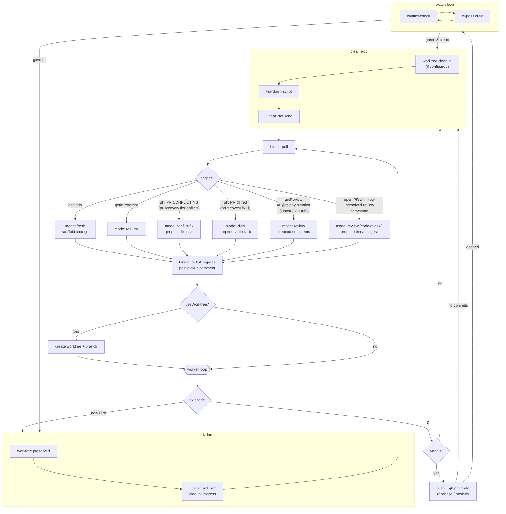

# Ralphy guide

Detailed reference for Ralphy's agent mode, Linear integration, PR + CI flow, and CLI surface. Start with the [README](./README.md) for installation and a high-level intro; come here when you're wiring up Linear, configuring `WORKFLOW.md`, or chasing a specific behavior.

## Contents

- [Configuration: `WORKFLOW.md`](#configuration-workflowmd)
- [Lifecycle and triggers](#lifecycle-and-triggers)
- [Linear indicators](#linear-indicators)
  - [Confirmation mode](#confirmation-mode-human-gate-before-implement)
  - [Review follow-ups (label trigger)](#review-follow-ups-label-trigger)
  - [`@ralphy` mention trigger](#ralphy-mention-trigger)
  - [Code-review iteration](#code-review-iteration)
  - [Self-review phase](#self-review-phase)
  - [Sync tasks into a Linear comment](#sync-tasks-into-a-linear-comment)
  - [Conflict re-fix / CI re-fix](#conflict-re-fix--ci-re-fix)
- [PR + CI integration](#pr--ci-integration)
- [Pre-existing error check](#pre-existing-error-check)
- [Worktrees, setup, teardown](#worktrees-setup-teardown)
- [Running under tmux](#running-under-tmux)
- [Dashboard and logs](#dashboard-and-logs)
- [CLI reference](#cli-reference)
- [Change layout (OpenSpec)](#change-layout-openspec)
- [MCP server](#mcp-server)

## Configuration: `WORKFLOW.md`

All configuration lives in **`WORKFLOW.md`** at the project root. YAML frontmatter holds settings; the body is a Jinja-style prompt template the worker renders for every iteration. A default file is written on first run. CLI flags override config per-invocation.

Example frontmatter:

```yaml
---
concurrency: 3
pollIntervalSeconds: 60
engine: claude
model: opus
useWorktree: true
createPrOnSuccess: true
autoMergeStrategy: squash
prRecovery:
  enabled: true
  fixCi: true
  fixConflicts: false

linear:
  team: ENG
  assignee: me
  postComments: true
  updateEveryIterations: 10
  mentionTrigger: true
  mentionHandle: "@ralphy"
  codeReviewTrigger: true
  codeReviewStaleHours: 24
  syncTasksToComment: true
  syncSpecsAsAttachments: true
  # Once a PR exists, how to handle a changed design attachment:
  #   replace (default) — overwrite the single canonical "Ralph design" attachment in place
  #   append            — publish each change as a new "Ralph design #N" attachment (audit trail)
  specAttachmentRevisions: replace

  indicators:
    getTodo:
      filter:
        - type: status
          value: Todo
    getInProgress:
      filter:
        - type: status
          value: In Progress
    setInProgress:
      type: status
      value: In Progress

    setDone:
      - type: status
        value: In Review
      - type: label
        value: ralphy-done
    getReview:
      filter:
        - type: label
          value: "ralph:review"
    clearReview:
      type: label
      value: "ralph:review"

    getAutoMerge:
      filter:
        - type: label
          value: "ralph:auto-merge"

    setError:
      type: label
      value: "ralph:error"
---
```

## Lifecycle and triggers

Each poll inspects Linear (and, when configured, GitHub PRs) and routes each issue into one of these spawn modes:

| Mode             | When it fires                                                                                                                                             | What changes                                                                                      |
| ---------------- | --------------------------------------------------------------------------------------------------------------------------------------------------------- | ------------------------------------------------------------------------------------------------- |
| **fresh**        | Issue matches `getTodo`                                                                                                                                   | Scaffold a new change, spawn worker, apply `setInProgress`                                        |
| **resume**       | Issue matches `getInProgress` (typical: agent restart)                                                                                                    | Re-attach to existing change directory, skip re-scaffold                                          |
| **conflict-fix** | A tracked PR (`setDone` candidate _or_ an in-progress ticket's PR) is detected as `CONFLICTING` via `gh pr view` and `prRecovery.fixConflicts` is enabled | Interrupt resume if needed, prepend a conflict-resolution task to `tasks.md`, reactivate state    |
| **ci-fix**       | A tracked PR's CI is red (`gh pr view --json statusCheckRollup`) and `prRecovery.fixCi` is enabled                                                        | Prepend a "Fix failing CI checks" task with gh-driven log inspection; reactivate state            |
| **review**       | Done issue carries the `getReview` marker (label trigger), _or_ a `@ralphy` mention is detected on Linear / the linked GitHub PR                          | Prepend a review task with the relevant comments; remove the `clearReview` label after pickup     |
| **code-review**  | Open tracked PR has unresolved review-thread comments newer than Ralph's last pickup ack                                                                  | Prepend a digest of unresolved comments with fix-or-reply instructions; repeats until PR approved |

> `conflict-fix` and `ci-fix` are routed entirely from GitHub state — there is no Linear `getConflicted` / `getCiFailed` indicator anymore. The merge-state scan reads `gh pr view` directly and enqueues the matching fix trigger.



The cycle repeats every poll. For code-review-iteration in particular, `setDone` re-applies between rounds so the next poll re-checks for new reviewer activity, until the PR is approved or merged.

## Linear indicators

Linear is the source of truth for which issues Ralph has touched. The `linear.indicators` map declares how Ralph queries and mutates Linear at each lifecycle event. All keys are optional; an unset key means "Ralph doesn't perform that action".

| Key             | Type                   | Purpose                                                                         |
| --------------- | ---------------------- | ------------------------------------------------------------------------------- |
| `getTodo`       | `{filter: Marker[]}`   | Issues to pick up (fresh)                                                       |
| `getInProgress` | `{filter: Marker[]}`   | Issues to resume after restart                                                  |
| `getReview`     | `{filter: Marker[]}`   | Done issues flagged for review follow-up                                        |
| `getAutoMerge`  | `{filter: Marker[]}`   | Issues whose PR should be auto-merged once required checks pass                 |
| `setInProgress` | `Marker` or `Marker[]` | Applied when a worker spawns (any non-resume mode)                              |
| `setDone`       | `Marker` or `Marker[]` | Applied on clean exit                                                           |
| `setError`      | `Marker` or `Marker[]` | Applied on non-zero exit (quarantine signal — issue is _not_ auto-resumed)      |
| `clearReview`   | `Marker` or `Marker[]` | Label(s) removed when a review pickup happens (status removal is not supported) |
| `getApproved`   | `{filter: Marker[]}`   | Approval signal that releases a confirmation-gated ticket into `implement`      |
| `clearApproved` | `Marker` or `Marker[]` | Label(s) removed once an approval is consumed (status removal is not supported) |

> Conflict and CI-failure routing no longer use Linear indicators — there's no `getConflicted` / `setConflicted` / `clearConflicted` (or `getCiFailed` / `setCiFailed` / `clearCiFailed`). GitHub is the source of truth: `gh pr view` produces the conflicted / ci-failed / mergeable counts and pushes `conflict-fix` / `ci-fix` queue entries directly.

A `Marker` is one of three types:

| Marker type    | Example value         | Effect                                                                                                                                                                                                                                    |
| -------------- | --------------------- | ----------------------------------------------------------------------------------------------------------------------------------------------------------------------------------------------------------------------------------------- |
| `"label"`      | `"ralph:in-progress"` | Adds or removes a Linear label on the issue                                                                                                                                                                                               |
| `"status"`     | `"In Progress"`       | Updates the Linear workflow status of the issue                                                                                                                                                                                           |
| `"attachment"` | `"In Progress"`       | Upserts a single **Ralphy** attachment on the issue; `value` becomes the subtitle. The same entry is reused across every lifecycle transition — Ralph creates it on first apply and edits it on subsequent ones, so the issue stays tidy. |

Use an array when one event sets multiple — e.g. `setDone` flipping a status _and_ adding a label _and_ updating the attachment subtitle.

### Confirmation mode (human gate before `implement`)

Set `linear.confirmationMode.enabled: true` to insert a human review step between the OpenSpec `tasks` and `implement` phases. Once the agent finishes drafting `tasks.md`, the ticket parks in the new `awaiting-confirmation` phase and Ralphy posts a one-shot **📋 Ralphy plan ready** Linear comment summarising the plan. Gated tickets do **not** consume a `concurrency` slot — the agent is free to pick up other work while waiting.

Three signals release (or skip) the gate:

| Signal                          | Effect                                                                                                                                                |
| ------------------------------- | ----------------------------------------------------------------------------------------------------------------------------------------------------- |
| Apply the `getApproved` marker  | Ralphy strips it via `clearApproved`, records the approval, and advances the ticket into `implement`.                                                 |
| Comment `@ralphy revise: <why>` | The reason is written into steering, the round counter bumps, the ticket loops back to `design`. Any in-flight worker is reaped immediately.          |
| Apply `optOutLabel`             | (default `ralph:auto-approve`) Bypasses the gate entirely — the ticket flows straight through `tasks` → `implement` as if confirmation mode were off. |

By default confirmation mode applies to every ticket. Set `linear.confirmationMode.optInLabel` (e.g. `ralph:needs-review`) to flip the polarity — only tickets carrying that label go through the gate; everything else implements straight through.

After `timeoutHours` (default `48`) with no activity Ralphy posts a single nudge comment per round. Tickets that exceed `maxConfirmationRounds` (default `3`) are labelled `ralph:stuck` and skipped on future polls until a human intervenes.

Wire up the matching indicators alongside the rest of the `linear.indicators` map:

```yaml
getApproved:
  filter:
    - type: label
      value: "ralph:approved"
clearApproved:
  type: label
  value: "ralph:approved"
```

See `linear.confirmationMode` in `WORKFLOW.md` for the full set of knobs.

### Review follow-ups (label trigger)

When a Linear issue is in a done state and a reviewer adds the `getReview` marker (typically a label like `ralph:review` left alongside comments), Ralph picks it up, applies `setInProgress`, removes the `clearReview` label so the trigger doesn't re-fire, filters out Ralph's own comments, and prepends every reviewer comment as a fresh task at the top of `tasks.md`. `setDone` re-applies on clean exit.

### `@ralphy` mention trigger

Set `linear.mentionTrigger: true` to scan Linear issue comments on every non-cancelled issue (Todo, In Progress, Backlog, Triage, Done) _and_ on the linked GitHub PR for a configurable handle (`linear.mentionHandle`, default `@ralphy`). Each unprocessed mention queues the issue as a review run, with the mention text used **verbatim** as the prepended task. Idempotency: a mention is processed when its `createdAt` is older than Ralph's latest `🔁 picked up` Linear comment, so the same comment never re-fires. Requires `gh` for the GitHub side.

### Code-review iteration

Set `linear.codeReviewTrigger: true` (or pass `--code-review`) to watch open, unmerged, unapproved tracked PRs for unresolved review-thread comments. New activity on any unresolved thread queues a review run whose task is a digest of every unresolved comment + instructions:

- **If Ralph agrees** with a comment — fix, commit, push, and resolve the thread (via `gh api graphql`'s `resolveReviewThread`).
- **If Ralph disagrees** — reply on the thread with reasoning via `gh api .../comments/{id}/replies` and leave it unresolved.

The loop exits; the next poll re-checks the PR. The cycle continues until the PR is **approved** or **merged**. If the reviewer is silent for more than `linear.codeReviewStaleHours` (default `24`, `0` disables) while Ralph is the last actor, one `@`-mention ping comment is posted on the GitHub PR.

### Self-review phase

Once every task in `tasks.md` is checked off, the worker can spawn an in-process reviewer pass before exiting. The reviewer reads `proposal.md`, `design.md`, and the diff, and either appends new tasks back into `tasks.md` (looping the worker for another round) or signs off. Configure under `openspec.reviewPhase`:

```yaml
openspec:
  reviewPhase:
    enabled: true
    maxRounds: 2 # hard cap on review iterations (default 1)
    reviewerModel: claude-sonnet-4-6 # override the reviewer's model (optional)
    reviewerContextStrategy: fresh # "fresh" = clean context per round (default), "warm" = reuse worker context
```

CLI equivalents: `--review-enabled`, `--review-max-rounds <N>`, `--review-model <id>`, `--review-context-strategy fresh|warm`. The worker passes these to itself when respawning, so the same review settings apply across `respawn` / `conflict-fix` / `ci-fix` lifecycles.

### Sync tasks into a Linear comment

`linear.syncTasksToComment` (default `true`) mirrors the active change's `tasks.md` into a dedicated Linear **comment** instead of the issue description. The same comment is updated in place across iterations so the timeline stays clean. When `ralph_append_steering` is invoked the existing tasks comment is deleted and re-posted so it always lands at the bottom of the timeline, after the new steering comment.

The first time planning completes (every `- [ ]` under `## Planning` in `tasks.md` becomes `- [x]`), Ralph posts a one-shot "📋 Plan" comment summarizing `proposal.md` (`## Why` + `## What Changes`) and the first paragraph of `design.md`.

### Conflict re-fix / CI re-fix

Every poll, the merge-state scanner reads `gh pr view --json state,mergeable,mergeStateStatus,statusCheckRollup` for each tracked PR:

- **`mergeable === "MERGEABLE"`** (CI green, no conflicts) → advance the in-review ticket to done: apply `setDone`, clear the in-progress label, and post a "PR is mergeable — moving to done" comment. Only tickets whose worker deferred `setDone` (PR-producing run, recovery enabled) are advanced; a ticket already done is left alone.
- **`mergeable === "CONFLICTING"`** (or `mergeStateStatus === "DIRTY"`) and `prRecovery.fixConflicts` is enabled → enqueue a `conflict-fix` run that prepends a conflict-resolution task to `tasks.md` and re-activates the change. In-progress tickets are interrupted in favour of fixing the merge state.
- **`statusCheckRollup` shows red CI** and `prRecovery.fixCi` is enabled → enqueue a `ci-fix` run that prepends a "Fix failing CI checks" task with `gh run view --log-failed` steps so the worker can read the failure logs.

The whole scan is gated on `prRecovery.enabled` — when it is off, the worker marks the ticket done immediately on PR open and nothing watches it afterwards (no advance, no recovery). When enabled, the worker opens the PR, leaves the ticket in-review, and the watcher owns the move to done and all recovery. Advancement-to-done fires whenever enabled; `fixConflicts` / `fixCi` independently gate only the recovery of red PRs. The worker performs no in-process conflict or CI fixing.

No Linear labels are involved in either path — `gh` is the single source of truth, and the matching `conflict-fix` / `ci-fix` queue entries land directly. A one-line Linear comment is posted for visibility when a ticket is promoted into a fix flow.

The scanner is resilient to:

- Transient `gh` failures (failed PR-discovery is cached with a 10-minute TTL — not permanent).
- Branch-name drift after a Linear title edit (falls back to `gh pr list --search "<ID> in:title state:open"`).
- GitHub's async `UNKNOWN` mergeability response (fibonacci backoff up to ~31s total, also consults `mergeStateStatus` which often resolves before `mergeable` does).

## PR + CI integration

| Flag / config                                               | Behavior                                                                                                                                                                                                                                                                                                                                                                                                                                                                                      |
| ----------------------------------------------------------- | --------------------------------------------------------------------------------------------------------------------------------------------------------------------------------------------------------------------------------------------------------------------------------------------------------------------------------------------------------------------------------------------------------------------------------------------------------------------------------------------- |
| `createPrOnSuccess` / `--create-pr`                         | After a clean exit, push the worker's branch and `gh pr create`. Title: `<ID>: <title>`. Idempotent — surfaces the existing URL if the PR is already open. Requires `--worktree` and `gh` authenticated. `prBaseBranch` defaults to `main`; override per-issue by labelling the Linear issue with `ralph:branch:<branch-name>`.                                                                                                                                                               |
| `stackPrsOnDependencies` / `--stack-prs`                    | When the Linear issue is blocked by another issue (`blocked_by` relation) that has exactly one open GitHub PR, open this PR against that blocker's head branch instead of `prBaseBranch`. Resolves the blocker's PR via Linear's auto-attachment + `gh pr view --json state,headRefName`. Falls back to `prBaseBranch` when zero / multiple blockers (or PRs) match. A `ralph:branch:<name>` label still wins.                                                                                |
| `getAutoMerge` indicator                                    | Opt an issue in for GitHub auto-merge (any-of label/status filter, same shape as `getReview`). When matched, Ralph runs `gh pr merge <url> --auto --<strategy>` right after opening the PR so GitHub merges as soon as required checks pass. Strategy comes from `autoMergeStrategy` (`squash` \| `merge` \| `rebase`, default `squash`). Failures are logged but non-fatal. (Repos with auto-merge disabled are left for manual merge — the worker no longer polls CI to merge them itself.) |
| `prRecovery.enabled` / `--pr-recovery` / `--no-pr-recovery` | Master switch (default `true`) for the PR-recovery watcher. When on, a PR-producing worker leaves the ticket in-review and the watcher advances it to done once the PR is mergeable, and recovers PRs that later go red. When off, the worker marks the ticket done immediately on PR open and nothing is watched. `--no-pr-recovery` / `--pr-recovery` override it for one run.                                                                                                              |
| `prRecovery.fixCi`                                          | Whether the watcher recovers failing CI (default `true`). Off leaves CI-red PRs for a human — the watcher still advances mergeable PRs to done. CI recovery enqueues a `ci-fix` worker that pulls failed logs via `gh run view --log-failed`; the worker pushes its fix and the watcher re-checks on the next poll. "Done" now means "PR mergeable" (CI green, no conflicts), reached when the watcher advances the in-review ticket — not "PR opened".                                       |
| `prRecovery.fixConflicts`                                   | Whether the watcher recovers merge conflicts (default `false`). Off leaves conflicting PRs for a human — the watcher still advances mergeable PRs to done. On, a `CONFLICTING` PR enqueues a `conflict-fix` worker that prepends a conflict-resolution task. Independent of `fixCi`; neither gates advancement-to-done.                                                                                                                                                                       |
| `prRecovery.maxRecoverySessions`                            | Give up auto-recovering a red PR after this many re-queue sessions (default `3`), then apply `ralph:error` and post a Linear comment. The counter resets when the PR becomes mergeable or a human clears `ralph:error`.                                                                                                                                                                                                                                                                       |
| `prRecovery.ignoreChecks`                                   | Array of CI check names the watcher ignores when computing pass/fail (e.g. known-flaky jobs).                                                                                                                                                                                                                                                                                                                                                                                                 |
| `codeReviewTrigger` / `--code-review`                       | See [Code-review iteration](#code-review-iteration).                                                                                                                                                                                                                                                                                                                                                                                                                                          |

## Pre-existing error check

Opt-in gate that protects the agent from chasing failures it cannot fix. When enabled (config `preExistingErrorCheck.enabled: true` or `--pre-existing-error-check`), on every poll tick Ralph runs the configured commands against the base branch HEAD. If any command fails:

1. A Linear issue is created with the failing command, exit code, and truncated output (fingerprint embedded in the body so re-runs with the same failure don't open duplicates).
2. The coordinator pauses — new fresh/resume/conflict-fix/review pickups are blocked until the trunk is green again. **In-flight workers are not killed.**
3. The dashboard shows a red `⛔ BASELINE BROKEN <LIN-ID> · <duration>` banner.

When the baseline goes green (the human merged the fix), the next poll lifts the pause automatically.

```yaml
preExistingErrorCheck:
  enabled: false
  commands: # falls back to commands.lint + commands.test when empty
    - bun run lint
    - bun run test
  baseBranch: main
  label: "ralph:pre-existing-error"
  outputCharLimit: 4000
```

## Worktrees, setup, teardown

With `useWorktree: true` (or `--worktree`) each task runs in an isolated worktree at `~/.ralph/<project>/worktrees/<change-name>` checked out onto a fresh `ralph/<change-name>` branch. Concurrent workers can't stomp on each other, and the worker's cwd _is_ the worktree.

- **`setupScript`** — `sh -c`-run inside the worktree right after scaffolding (e.g. `bun install`, `cp .env.example .env`).
- **`teardownScript`** — `sh -c`-run after the loop exits and (optional) worktree cleanup.

Both scripts receive `WORKSPACE_ROOT` in their environment — the absolute path to the origin repository (the parent of the worktree). Use it to reference project-root files from inside a worktree, e.g. `cp "$WORKSPACE_ROOT/.env.example" .env`.

- **`cleanupWorktreeOnSuccess`** — remove the worktree on clean exit. Failed workers always keep their worktree + branch for human inspection.

Both scripts log failures but never block the loop. **`appendPrompt`** (or `--prompt` in agent mode) is appended to every scaffolded `proposal.md` under `## Additional instructions` — use it for cross-cutting guidance every task should see.

## Running under tmux

If `tmux` is on `$PATH`, `ralphy agent` re-execs itself inside a managed tmux session on first launch (per-workspace name). Detaching the terminal — closing the SSH session, the laptop lid, the `tmux detach` keybind — leaves the agent running. Re-running `ralphy agent` from the same workspace attaches to the existing session instead of starting a second copy.

| Command                  | Behavior                                                                   |
| ------------------------ | -------------------------------------------------------------------------- |
| `ralphy agent`           | Attach to the managed tmux session, or start one if absent                 |
| `ralphy agent status`    | Report whether the managed session exists and is currently attached        |
| `ralphy agent stop`      | Kill the managed session (workers exit cleanly)                            |
| `ralphy agent --no-tmux` | Skip tmux entirely and run the agent in the foreground (CI, scripted runs) |

## Dashboard and logs

The terminal dashboard shows three always-visible panels: **RALPH AGENT** (engine/model, concurrency, poll interval, active limits, feature flags, Linear filter), **POLL STATUS + WORKERS** (last-poll bucket breakdown — `todo · res · conf · rev · @` (each colored when non-zero) plus `↺ Ns` next-poll countdown, active/queued worker totals), and **TASKS tab bar** (numbered worker tabs — `Tab` / `← →` / `1-9` to switch).

Each worker card shows: priority badge + identifier + title + mode badge, `↗ LINEAR`, `↗ PR`, `▶ TASK` (first unchecked task from `tasks.md`, refreshed every second), `PHASE` with color + elapsed time, `⏵ CMD` when a shell command is in flight, `LOG` path for `tail -f`, and `─ OUTPUT ─` with live stdout/stderr.

Log files (every line is `[ISO] [type] message`):

| File                                     | Contains                                                                                  |
| ---------------------------------------- | ----------------------------------------------------------------------------------------- |
| `~/.ralph/agent-mode.log`                | Global session log, appended each agent run                                               |
| `<projectRoot>/.ralph/logs/<change>.log` | Per-worker unified log: output + phases + coordinator events                              |
| `<taskDir>/LOG.jsonl`                    | Structured JSON event log used by the web UI                                              |
| `<path from --json-log-file>`            | Mirror of the structured event stream (state changes, phases, polls) — file-tail friendly |

Failed workers are not marked processed, so they retry on the next poll. SIGINT / SIGTERM cleanly stops polling and kills active workers. All Linear side effects are best-effort — failures log a warning but never block the loop.

## CLI reference

**Task flags**

| Option                 | Description                                               |
| ---------------------- | --------------------------------------------------------- |
| `--name <name>`        | Task name (required for most commands)                    |
| `--prompt <text>`      | Task description                                          |
| `--prompt-file <path>` | Read prompt from file                                     |
| `--claude [model]`     | Use Claude engine (haiku / sonnet / opus, default opus)   |
| `--codex`              | Use Codex engine                                          |
| `--model <model>`      | Set model (haiku / sonnet / opus)                         |
| `--max-iterations <N>` | Stop after N iterations (`0` = unlimited)                 |
| `--max-cost <N>`       | Stop when total cost exceeds $N                           |
| `--max-runtime <N>`    | Stop after N minutes                                      |
| `--max-failures <N>`   | Stop after N consecutive identical failures (default `5`) |
| `--unlimited`          | Sets max iterations to 0 (default)                        |
| `--delay <N>`          | Seconds between iterations                                |
| `--manual-test`        | Enable manual-test phase (creates test tasks)             |
| `--log`                | Log raw engine stream                                     |
| `--verbose`            | Verbose output                                            |

**Agent-mode flags**

| Option                               | Behavior                                                                                       |
| ------------------------------------ | ---------------------------------------------------------------------------------------------- |
| `--linear-team <key>`                | Linear team key (e.g. `ENG`)                                                                   |
| `--linear-assignee <id>`             | Assignee filter (user id, email, or `me`)                                                      |
| `--poll-interval <s>`                | Seconds between Linear polls (default `60`)                                                    |
| `--concurrency <n>`                  | Max concurrent task loops (default `1`)                                                        |
| `--max-tickets <n>`                  | Stop picking up new issues after N have been started this run (`0` = unlimited)                |
| `--worktree`                         | Run each task in its own git worktree                                                          |
| `--indicator <k>:<t>:<v>`            | Override one `linear.indicators` entry (repeatable, e.g. `setDone:status:Done`)                |
| `--create-pr`                        | Push worker branch + open a GitHub PR on success (needs `--worktree`)                          |
| `--no-pr-recovery` / `--pr-recovery` | Force the post-done PR-recovery watcher off / on for this run (overrides `prRecovery.enabled`) |
| `--stack-prs`                        | Open the PR against a blocker issue's open-PR head branch when present (needs `--create-pr`)   |
| `--code-review`                      | Watch open tracked PRs for unresolved review comments and prepend a code-review task           |
| `--json-output`                      | Emit JSONL to stdout instead of rendering the Ink dashboard (CI / scripting)                   |
| `--json-log-file <path>`             | Mirror the JSONL event stream to a file alongside the TUI or `--json-output`                   |
| `--no-tmux`                          | Don't auto-reexec under tmux; run the agent in the foreground                                  |
| `--review-enabled`                   | Enable the worker's self-review phase (see [Self-review phase](#self-review-phase))            |
| `--review-max-rounds <N>`            | Hard cap on review rounds per task (default `1`)                                               |
| `--review-model <id>`                | Override the reviewer's model (defaults to the worker's model)                                 |
| `--review-context-strategy <s>`      | `fresh` (default) for a clean reviewer context per round, or `warm` to reuse the worker        |

**List-mode flags**

| Option                | Behavior                                                                                                                                                                                    |
| --------------------- | ------------------------------------------------------------------------------------------------------------------------------------------------------------------------------------------- |
| `--debug --name <id>` | Diagnose why a Linear ticket (e.g. `ENG-42`) is not being picked up — checks team, assignee, include / exclude markers, and blocked-by relations against every configured `get*` indicator. |

`ralph list` reads `WORKFLOW.md` and, when `LINEAR_API_KEY` is set, fetches every issue matching each configured `getTodo` / `getInProgress` / `getReview` / `getAutoMerge` indicator using the same include / exclude rules as `ralph agent`. For each ticket it also resolves the linked GitHub PR URL from Linear attachments and prints its conflict / CI status from `gh pr view`.

**`--max-tickets`.** Caps how many issues ralph picks up in a single agent run. Once the limit is hit the coordinator stops enqueuing new work; in-flight workers continue to completion, and the dashboard header shows `│ tickets ≤N`. The limit resets each restart.

## Change layout (OpenSpec)

There are no phases. One loop, one prompt, one `tasks.md` checklist. Each change lives in `<projectRoot>/openspec/changes/<name>/` (managed by OpenSpec) plus `<projectRoot>/.ralph/tasks/<name>/` (loop state only):

| File / Directory                        | Purpose                                                   |
| --------------------------------------- | --------------------------------------------------------- |
| `openspec/changes/<name>/proposal.md`   | Description, goals, and the `## Steering` section         |
| `openspec/changes/<name>/design.md`     | Technical design and architecture decisions               |
| `openspec/changes/<name>/tasks.md`      | Checklist driving iteration — one unchecked item per loop |
| `openspec/changes/<name>/specs/`        | Per-task specifications                                   |
| `.ralph/tasks/<name>/.ralph-state.json` | Loop state (iteration count, status, cost, history)       |
| `.ralph/tasks/<name>/STOP`              | Create this file to signal the loop to stop               |

Steering is delivered by editing the `## Steering` section of `proposal.md`. The agent reads it at the start of every iteration.

## MCP server

Ralphy includes an MCP server that exposes task-management tools to Claude agents. It's auto-configured during installation.

| Tool                    | Purpose                                    |
| ----------------------- | ------------------------------------------ |
| `ralph_list_changes`    | List changes with status                   |
| `ralph_get_change`      | Get change details                         |
| `ralph_create_change`   | Create and optionally start a change       |
| `ralph_append_steering` | Append a steering message to `proposal.md` |
| `ralph_stop`            | Stop a running change                      |
