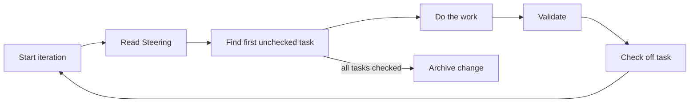

# Ralphy

An iterative AI task execution framework. Ralphy orchestrates multi-phase autonomous work using Claude or Codex engines, with built-in state management, progress tracking, and cost safeguards.

## How It Works

Ralphy runs a single continuous loop against an OpenSpec change — no phases, no phase transitions.



Each iteration reads the `## Steering` section of `proposal.md`, picks the first unchecked item from `tasks.md`, does the work, validates, and checks the item off. When all items are checked the loop archives the change automatically.

## Installation

### npm (global)

```bash
npm install -g ralphy
# or
bunx ralphy
```

Requires [Bun](https://bun.sh) as the runtime.

### Local (per-project)

```bash
bun install
make install            # Install to ./.ralph
make install ~           # Install to ~/.ralph
make install /path/to   # Install to /path/to/.ralph
```

This builds the CLI and MCP server, copies them to `.ralph/bin/`, sets up phase definitions and templates, configures `.mcp.json`, and adds a `ralph` script to `package.json`. The `.ralph/` directory is gitignored by default.

### Prerequisites

- [Bun](https://bun.sh)
- [Claude CLI](https://docs.anthropic.com/en/docs/claude-cli) (for the Claude engine)
- `jq` (for installation)

## Usage

### Create and Run a Task

```bash
ralph task --name fix-auth --prompt "Fix the JWT validation bug" --claude opus --max-iterations 10
```

The engine defaults to Claude Opus.

### Resume a Change

```bash
ralph task --name fix-auth
```

If the task already exists, it resumes from where it left off.

### Check Status

```bash
ralph list                    # Table of all tasks
ralph status --name fix-auth  # Detailed view of one task
```

### Agent Mode (Linear integration)

`ralph agent` polls Linear for open issues and runs up to N concurrent task loops, scaffolding an OpenSpec change per new issue. Requires `LINEAR_API_KEY` in the environment.

```bash
export LINEAR_API_KEY=lin_api_xxx
ralph agent --linear-team ENG --linear-assignee me --concurrency 3 --poll-interval 60
```

What it does on each tick:

1. Polls Linear for open issues matching the filter (team / assignee / status / labels)
2. Dedupes against `.ralph/agent-state.json` (already processed) plus any in-flight workers
3. For each new issue: fetches existing comments, scaffolds `openspec/changes/<id-slug>/{proposal.md,tasks.md,design.md}` (with the comments embedded so the worker sees prior discussion), then spawns `ralph task --name <id-slug>` up to the concurrency cap
4. Posts a "🤖 started" comment on the Linear issue and (optionally) moves it to `inProgressStatus`
5. On worker exit, posts a success/failure comment and (on success) moves the issue to `doneStatus` and/or applies `doneLabel`

Defaults are written to `ralphy.config.json` on first run; CLI flags override config values per invocation.

```jsonc
{
  "concurrency": 3,
  "pollIntervalSeconds": 60,
  "maxIterationsPerTask": 0,
  "maxCostUsdPerTask": 0,
  "engine": "claude",
  "model": "opus",
  "linear": {
    "team": "ENG",
    "assignee": "me",
    "statuses": ["Todo", "In Progress"],
    "labels": ["ralph", "automation"],
    "inProgressStatus": "In Progress",
    "doneStatus": "In Review",
    "doneLabel": "ralphy-done",
    "postComments": true,
    "updateEveryIterations": 10,
  },
  "useWorktree": true,
  "cleanupWorktreeOnSuccess": false,
  "setupScript": "bun install",
  "teardownScript": "git status",
  "appendPrompt": "Always run lint before committing.",
  "createPrOnSuccess": true,
  "prBaseBranch": "main",
  "fixCiOnFailure": true,
  "maxCiFixAttempts": 5,
  "ciPollIntervalSeconds": 30,
  "maxRuntimeMinutesPerTask": 0,
  "maxConsecutiveFailuresPerTask": 5,
  "iterationDelaySeconds": 0,
  "logRawStream": false,
  "taskVerbose": false,
}
```

`doneStatus` and `doneLabel` are independent — set either, both, or neither. Use `doneLabel` if your team marks completion via a label rather than a workflow state.

#### Per-task git worktrees

With `--worktree` (or `useWorktree: true` in config) each task runs in an isolated worktree at `.ralph/worktrees/<change-name>` checked out onto a fresh `ralph/<change-name>` branch. The change is scaffolded _inside_ the worktree, and the loop's cwd is the worktree, so concurrent workers can't stomp on each other.

Use `setupScript` (run inside the worktree right after scaffolding) to install dependencies, copy `.env`, etc. Use `teardownScript` (run after the loop exits, before any worktree cleanup) to gather artifacts or roll back local mutations. Both run via `sh -c`; failures are logged but never block the loop. With `cleanupWorktreeOnSuccess: true` the worktree is removed when the worker exits 0 — failed workers always keep their worktree (and branch) for human inspection.

**`appendPrompt`** (or `--prompt` in agent mode) is appended to every scaffolded `proposal.md` under an `## Additional instructions` section — use it for cross-cutting guidance every task should see.

**`updateEveryIterations`** (default `10`, `0` disables) posts a "🔄 Ralph progress update: iteration N" comment on the Linear issue every N task iterations. Requires `postComments: true`.

**`createPrOnSuccess`** (or `--create-pr`) pushes the worker's branch and opens a GitHub PR via `gh` after a clean exit. Requires `--worktree` (the PR needs a branch to point at) and the `gh` CLI authenticated. The PR title is `<ID>: <title>`, the body links the Linear issue. If a PR already exists for the branch the existing URL is reported (idempotent for retries). `prBaseBranch` defaults to `main`.

**`fixCiOnFailure`** (or `--fix-ci`) watches the PR's checks via `gh pr checks` and, on failure, fetches the failed-run logs (`gh run view --log-failed`), appends them to `proposal.md` under `## Steering`, re-spawns the task loop in the worktree, and pushes the new commits — repeating until checks go green or `maxCiFixAttempts` is hit (default 5, polling interval `ciPollIntervalSeconds` defaults to 30s). Requires `--create-pr`.

When `fixCiOnFailure` is enabled, the issue is **not** moved to `doneStatus` (and `doneLabel` is not applied, and the issue is not marked processed in `.ralph/agent-state.json`) until CI actually goes green. If the fix loop exhausts its attempts the worker is treated as failed for completion-marking purposes and the issue will be re-picked-up on the next poll (the resume-in-progress filter ensures that).

Every CLI flag is also configurable in `ralphy.config.json`; CLI values override config when both are set. The agent forwards `maxRuntimeMinutesPerTask` / `maxConsecutiveFailuresPerTask` / `iterationDelaySeconds` / `logRawStream` / `taskVerbose` to each spawned `ralph task` worker.

Failed workers (non-zero exit) are not marked processed, so they'll be retried on the next poll. SIGINT/SIGTERM cleanly stops polling and kills active workers. All Linear side effects are best-effort — failures log a warning but never block the task loop.

## CLI Options

| Option                 | Description                                              |
| ---------------------- | -------------------------------------------------------- |
| `--name <name>`        | Task name (required for most commands)                   |
| `--prompt <text>`      | Task description                                         |
| `--prompt-file <path>` | Read prompt from a file                                  |
| `--claude [model]`     | Use Claude engine (haiku/sonnet/opus)                    |
| `--codex`              | Use Codex engine                                         |
| `--model <model>`      | Set model (haiku/sonnet/opus)                            |
| `--max-iterations <N>` | Stop after N iterations (0 = unlimited)                  |
| `--max-cost <N>`       | Stop when cost exceeds $N                                |
| `--max-runtime <N>`    | Stop after N minutes                                     |
| `--max-failures <N>`   | Stop after N consecutive identical failures (default: 5) |
| `--unlimited`          | Set max iterations to 0 (unlimited, default)             |
| `--delay <N>`          | Seconds to wait between iterations                       |
| `--log`                | Log raw JSON stream output                               |
| `--verbose`            | Verbose output                                           |

### Agent mode flags

| Option                        | Description                                                                  |
| ----------------------------- | ---------------------------------------------------------------------------- |
| `--linear-team <key>`         | Linear team key (e.g. `ENG`)                                                 |
| `--linear-assignee <id>`      | Filter by assignee (user id, email, or `me`)                                 |
| `--linear-status <name>`      | Filter by status name (repeatable)                                           |
| `--linear-label <name>`       | Filter by label name (repeatable, any-of)                                    |
| `--poll-interval <s>`         | Seconds between Linear polls (default: 60)                                   |
| `--concurrency <n>`           | Max concurrent task loops (default: 1)                                       |
| `--worktree`                  | Run each task in its own git worktree                                        |
| `--in-progress-status <name>` | Linear status to set when work starts                                        |
| `--done-status <name>`        | Linear status to set on successful completion                                |
| `--done-label <name>`         | Linear label to add on successful completion                                 |
| `--create-pr`                 | Push worker branch + open a GitHub PR on success (needs `--worktree`)        |
| `--fix-ci`                    | After PR opens, re-run task on CI failures until green (needs `--create-pr`) |

## OpenSpec Flow

There are no phases. One loop, one prompt, one `tasks.md` checklist.

Each change lives in `.ralph/tasks/<name>/`:

| File / Directory    | Purpose                                                   |
| ------------------- | --------------------------------------------------------- |
| `proposal.md`       | Description, goals, and the `## Steering` section         |
| `design.md`         | Technical design and architecture decisions               |
| `tasks.md`          | Checklist driving iteration — one unchecked item per loop |
| `specs/`            | Detailed specifications for individual tasks              |
| `.ralph-state.json` | Loop state (iteration count, status, cost, history)       |
| `STOP`              | Create this file to signal the loop to stop               |

Steering is delivered by editing the `## Steering` section of `proposal.md`. The agent reads it at the start of every iteration.

## MCP Server

Ralphy includes an MCP server that exposes task management tools to Claude agents. It's automatically configured during installation. Available tools:

- `ralph_list_changes` — List changes with status
- `ralph_get_change` — Get change details
- `ralph_create_change` — Create and optionally start a change
- `ralph_append_steering` — Append a steering message to `proposal.md`
- `ralph_stop` — Stop a running change

## Project Structure

```
ralphy/
├── apps/
│   ├── cli/          # CLI application
│   └── mcp/          # MCP server
├── packages/
│   ├── core/         # State management and loop
│   ├── context/      # Storage abstraction
│   ├── content/      # Base prompt and task templates
│   ├── engine/       # Claude/Codex engine spawning
│   ├── openspec/     # ChangeStore interface and OpenSpec adapter
│   ├── output/       # Terminal formatting
│   └── types/        # Zod schemas and types
└── Makefile
```

## Development

```bash
bun install
bunx nx run-many -t lint,typecheck,test,build   # Run checks
bunx nx run cli:build                            # Build CLI only
```
