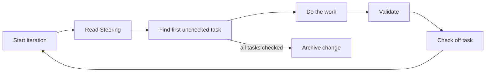
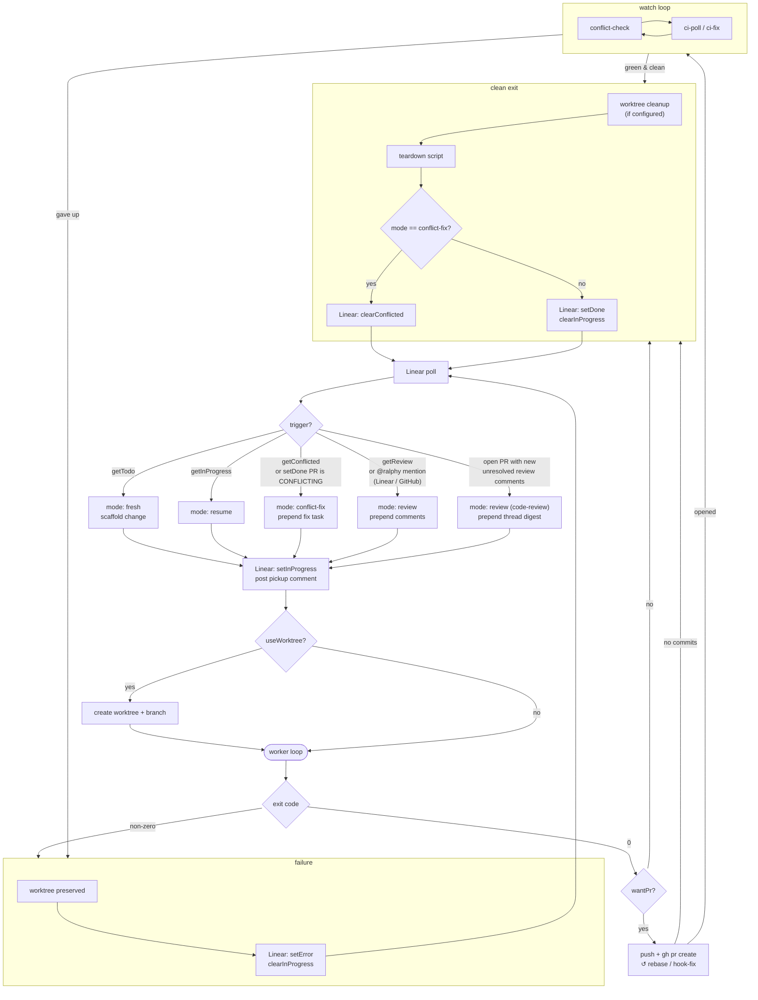

# Ralphy

[](https://www.npmjs.com/package/@neriros/ralphy)
[](https://www.npmjs.com/package/@neriros/ralphy)
[](https://github.com/NeriRos/ralphy/blob/main/LICENSE)
[](https://github.com/NeriRos/ralphy)
[](https://github.com/NeriRos/ralphy/issues)
[](https://bun.sh)

An iterative AI task execution framework. Ralphy orchestrates autonomous work using Claude or Codex with built-in state management, progress tracking, and cost safeguards. It can run as a one-shot task or as a long-lived **agent** that polls Linear, ships PRs, and iterates with reviewers.

## Contents

- [How it works](#how-it-works)
- [Install](#install)
- [Task mode](#task-mode) — single-task / single-loop usage
- [Agent mode](#agent-mode) — Linear-driven autonomous loop
  - [Lifecycle and triggers](#lifecycle-and-triggers)
  - [Linear indicators](#linear-indicators)
  - [PR + CI integration](#pr--ci-integration)
  - [Worktrees, setup, teardown](#worktrees-setup-teardown)
  - [Dashboard and logs](#dashboard-and-logs)
- [CLI reference](#cli-reference)
- [Change layout (OpenSpec)](#change-layout-openspec)
- [MCP server](#mcp-server)
- [Project structure and development](#project-structure-and-development)

## How it works

Ralphy runs a single continuous loop against an OpenSpec change — no phases, no phase transitions.



Each iteration reads the `## Steering` section of `proposal.md`, picks the first unchecked item from `tasks.md`, does the work, validates, and checks the item off. When every item is checked the loop archives the change.

## Install

Requires [Bun](https://bun.sh). For the Claude engine you also need the [Claude CLI](https://docs.anthropic.com/en/docs/claude-cli). The Makefile install path additionally needs `jq`.

```bash
# Global (recommended)
npm install -g @neriros/ralphy
# or run without installing
bunx @neriros/ralphy

# Per-project install (builds + wires .ralph/ into the repo)
bun install
make install            # → ./.ralph
make install ~          # → ~/.ralph
make install /path/to   # → /path/to/.ralph
```

The per-project install builds the CLI and MCP server, copies them to `.ralph/bin/`, sets up templates, wires `.mcp.json`, and adds a `ralph` script to `package.json`. `.ralph/` is gitignored by default.

## Task mode

```bash
# Create + run a new task
ralph task --name fix-auth --prompt "Fix the JWT validation bug" --claude opus --max-iterations 10

# Resume the same task later (state is on disk)
ralph task --name fix-auth

# Inspect
ralph list                    # all tasks (table)
ralph status --name fix-auth  # one task (details)
```

Engine defaults to Claude Opus. Common safeguards: `--max-iterations`, `--max-cost`, `--max-runtime`, `--max-failures`. See the [CLI reference](#cli-reference) for the full set.

## Agent mode

`ralph agent` polls Linear, runs up to N concurrent task loops, and (optionally) opens PRs, watches CI, and iterates with reviewers. Requires `LINEAR_API_KEY`.

```bash
export LINEAR_API_KEY=lin_api_xxx
ralph agent --linear-team ENG --linear-assignee me --concurrency 3 --poll-interval 60
```

A default `ralphy.config.json` is written on first run. CLI flags override config per-invocation.

### Lifecycle and triggers

Each poll inspects Linear (and, when configured, GitHub PRs) and routes each issue into one of these spawn modes:

| Mode             | When it fires                                                                                                                    | What changes                                                                                      |
| ---------------- | -------------------------------------------------------------------------------------------------------------------------------- | ------------------------------------------------------------------------------------------------- |
| **fresh**        | Issue matches `getTodo`                                                                                                          | Scaffold a new change, spawn worker, apply `setInProgress`                                        |
| **resume**       | Issue matches `getInProgress` (typical: agent restart)                                                                           | Re-attach to existing change directory, skip re-scaffold                                          |
| **conflict-fix** | Issue matches `getConflicted`, _or_ `setDone` issue's PR is detected as `CONFLICTING`                                            | Prepend a conflict-resolution task to `tasks.md`, reactivate state                                |
| **review**       | Done issue carries the `getReview` marker (label trigger), _or_ a `@ralphy` mention is detected on Linear / the linked GitHub PR | Prepend a review task with the relevant comments; remove the `clearReview` label after pickup     |
| **code-review**  | Open tracked PR has unresolved review-thread comments newer than Ralph's last pickup ack                                         | Prepend a digest of unresolved comments with fix-or-reply instructions; repeats until PR approved |



The cycle repeats every poll. For code-review-iteration in particular, `setDone` re-applies between rounds so the next poll re-checks for new reviewer activity, until the PR is approved or merged.

### Linear indicators

Linear is the source of truth for which issues Ralph has touched. The `linear.indicators` map declares how Ralph queries and mutates Linear at each lifecycle event. All keys are optional; an unset key means "Ralph doesn't perform that action".

| Key               | Type                   | Purpose                                                                         |
| ----------------- | ---------------------- | ------------------------------------------------------------------------------- |
| `getTodo`         | `{filter: Marker[]}`   | Issues to pick up (fresh)                                                       |
| `getInProgress`   | `{filter: Marker[]}`   | Issues to resume after restart                                                  |
| `getConflicted`   | `{filter: Marker[]}`   | Issues whose PR is conflicted (re-fix run)                                      |
| `getReview`       | `{filter: Marker[]}`   | Done issues flagged for review follow-up                                        |
| `getAutoMerge`    | `{filter: Marker[]}`   | Issues whose PR should be auto-merged once required checks pass                 |
| `setInProgress`   | `Marker` or `Marker[]` | Applied when a worker spawns (any non-resume mode)                              |
| `setDone`         | `Marker` or `Marker[]` | Applied on clean exit                                                           |
| `setError`        | `Marker` or `Marker[]` | Applied on non-zero exit (quarantine signal — issue is _not_ auto-resumed)      |
| `setConflicted`   | `Marker` or `Marker[]` | Applied when a done-PR is detected as conflicted                                |
| `clearConflicted` | `Marker` or `Marker[]` | Label(s) removed when a conflict-fix succeeds (status removal is not supported) |
| `clearReview`     | `Marker` or `Marker[]` | Label(s) removed when a review pickup happens (status removal is not supported) |

A `Marker` is one of three types:

| Marker type    | Example value         | Effect                                                                                                                                                                                                                                    |
| -------------- | --------------------- | ----------------------------------------------------------------------------------------------------------------------------------------------------------------------------------------------------------------------------------------- |
| `"label"`      | `"ralph:in-progress"` | Adds or removes a Linear label on the issue                                                                                                                                                                                               |
| `"status"`     | `"In Progress"`       | Updates the Linear workflow status of the issue                                                                                                                                                                                           |
| `"attachment"` | `"In Progress"`       | Upserts a single **Ralphy** attachment on the issue; `value` becomes the subtitle. The same entry is reused across every lifecycle transition — Ralph creates it on first apply and edits it on subsequent ones, so the issue stays tidy. |

Use an array when one event sets multiple — e.g. `setDone` flipping a status _and_ adding a label _and_ updating the attachment subtitle.

Example `ralphy.config.json`:

```jsonc
{
  "concurrency": 3,
  "pollIntervalSeconds": 60,
  "engine": "claude",
  "model": "opus",
  "useWorktree": true,
  "createPrOnSuccess": true,
  "autoMergeStrategy": "squash",
  "fixCiOnFailure": true,
  "linear": {
    "team": "ENG",
    "assignee": "me",
    "postComments": true,
    "updateEveryIterations": 10,
    "mentionTrigger": true,
    "mentionHandle": "@ralphy",
    "codeReviewTrigger": true,
    "codeReviewStaleHours": 24,
    "indicators": {
      "getTodo": { "filter": [{ "type": "status", "value": "Todo" }] },
      "getInProgress": {
        "filter": [{ "type": "status", "value": "In Progress" }],
      },
      "getConflicted": {
        "filter": [{ "type": "label", "value": "ralph:conflicted" }],
      },
      "getReview": { "filter": [{ "type": "label", "value": "ralph:review" }] },
      "getAutoMerge": {
        "filter": [{ "type": "label", "value": "ralph:auto-merge" }],
      },
      "setInProgress": { "type": "status", "value": "In Progress" },
      "setDone": [
        { "type": "status", "value": "In Review" },
        { "type": "label", "value": "ralphy-done" },
      ],
      "setError": { "type": "label", "value": "ralph:error" },
      "setConflicted": { "type": "label", "value": "ralph:conflicted" },
      "clearConflicted": { "type": "label", "value": "ralph:conflicted" },
      "clearReview": { "type": "label", "value": "ralph:review" },
    },
  },
}
```

#### Review follow-ups (label trigger)

When a Linear issue is in a done state and a reviewer adds the `getReview` marker (typically a label like `ralph:review` left alongside comments), Ralph picks it up, applies `setInProgress`, removes the `clearReview` label so the trigger doesn't re-fire, filters out Ralph's own comments, and prepends every reviewer comment as a fresh task at the top of `tasks.md`. `setDone` re-applies on clean exit.

#### `@ralphy` mention trigger

Set `linear.mentionTrigger: true` to scan done-issue comments on Linear _and_ on the linked GitHub PR for a configurable handle (`linear.mentionHandle`, default `@ralphy`). Each unprocessed mention queues the issue as a review run, with the mention text used **verbatim** as the prepended task. Idempotency: a mention is processed when its `createdAt` is older than Ralph's latest `🔁 picked up` Linear comment, so the same comment never re-fires. Requires `gh` for the GitHub side.

#### Code-review iteration

Set `linear.codeReviewTrigger: true` (or pass `--code-review`) to watch open, unmerged, unapproved tracked PRs for unresolved review-thread comments. New activity on any unresolved thread queues a review run whose task is a digest of every unresolved comment + instructions:

- **If Ralph agrees** with a comment — fix, commit, push, and resolve the thread (via `gh api graphql`'s `resolveReviewThread`).
- **If Ralph disagrees** — reply on the thread with reasoning via `gh api .../comments/{id}/replies` and leave it unresolved.

The loop exits; the next poll re-checks the PR. The cycle continues until the PR is **approved** or **merged**. If the reviewer is silent for more than `linear.codeReviewStaleHours` (default `24`, `0` disables) while Ralph is the last actor, one `@`-mention ping comment is posted on the GitHub PR.

#### Conflict re-fix

Done issues whose PR `gh pr view --json mergeable` reports as `CONFLICTING` get `setConflicted` applied and a conflict-fix task prepended. The scanner is resilient to:

- Transient `gh` failures (failed PR-discovery is cached with a 10-minute TTL — not permanent).
- Branch-name drift after a Linear title edit (falls back to `gh pr list --search "<ID> in:title state:open"`).
- GitHub's async `UNKNOWN` mergeability response (retries up to 3× with 2s gaps; logs when UNKNOWN persists).

### PR + CI integration

| Flag / config                         | Behavior                                                                                                                                                                                                                                                                                                                                                                                                            |
| ------------------------------------- | ------------------------------------------------------------------------------------------------------------------------------------------------------------------------------------------------------------------------------------------------------------------------------------------------------------------------------------------------------------------------------------------------------------------- |
| `createPrOnSuccess` / `--create-pr`   | After a clean exit, push the worker's branch and `gh pr create`. Title: `<ID>: <title>`. Idempotent — surfaces the existing URL if the PR is already open. Requires `--worktree` and `gh` authenticated. `prBaseBranch` defaults to `main`; override per-issue by labelling the Linear issue with `ralph:branch:<branch-name>`.                                                                                     |
| `getAutoMerge` indicator              | Opt an issue in for GitHub auto-merge (any-of label/status filter, same shape as `getReview`). When matched, Ralph runs `gh pr merge <url> --auto --<strategy>` right after opening the PR so GitHub merges as soon as required checks pass. Strategy comes from `autoMergeStrategy` (`squash` \| `merge` \| `rebase`, default `squash`). Failures are logged but non-fatal — the CI/conflict watch loop continues. |
| `fixCiOnFailure` / `--fix-ci`         | After the PR opens, poll `gh pr checks`. On failure, pull failed logs via `gh run view --log-failed`, append them to `## Steering`, re-spawn the worker, and push the new commits — repeat until green or `maxCiFixAttempts` (default `5`) is hit. While this loop runs, `setDone` is **not** applied; if CI is never green the worker is treated as failed.                                                        |
| `ciPollIntervalSeconds`               | Seconds between CI status polls (default `30`).                                                                                                                                                                                                                                                                                                                                                                     |
| `ignoreCiChecks`                      | Array of check names to ignore when computing pass/fail.                                                                                                                                                                                                                                                                                                                                                            |
| `codeReviewTrigger` / `--code-review` | See [Code-review iteration](#code-review-iteration).                                                                                                                                                                                                                                                                                                                                                                |

### Worktrees, setup, teardown

With `useWorktree: true` (or `--worktree`) each task runs in an isolated worktree at `~/.ralph/<project>/worktrees/<change-name>` checked out onto a fresh `ralph/<change-name>` branch. Concurrent workers can't stomp on each other, and the worker's cwd _is_ the worktree.

- **`setupScript`** — `sh -c`-run inside the worktree right after scaffolding (e.g. `bun install`, `cp .env.example .env`).
- **`teardownScript`** — `sh -c`-run after the loop exits and (optional) worktree cleanup.

Both scripts receive `WORKSPACE_ROOT` in their environment — the absolute path to the origin repository (the parent of the worktree). Use it to reference project-root files from inside a worktree, e.g. `cp "$WORKSPACE_ROOT/.env.example" .env`.

- **`cleanupWorktreeOnSuccess`** — remove the worktree on clean exit. Failed workers always keep their worktree + branch for human inspection.

Both scripts log failures but never block the loop. **`appendPrompt`** (or `--prompt` in agent mode) is appended to every scaffolded `proposal.md` under `## Additional instructions` — use it for cross-cutting guidance every task should see.

### Dashboard and logs

The terminal dashboard shows three always-visible panels: **RALPH AGENT** (engine/model, concurrency, poll interval, active limits, feature flags, Linear filter), **POLL STATUS + WORKERS** (last-poll bucket breakdown — `todo · res · conf · rev · @` (each colored when non-zero) plus `↺ Ns` next-poll countdown, active/queued worker totals), and **TASKS tab bar** (numbered worker tabs — `Tab` / `← →` / `1-9` to switch).

Each worker card shows: priority badge + identifier + title + mode badge, `↗ LINEAR`, `↗ PR`, `▶ TASK` (first unchecked task from `tasks.md`, refreshed every second), `PHASE` with color + elapsed time, `⏵ CMD` when a shell command is in flight, `LOG` path for `tail -f`, and `─ OUTPUT ─` with live stdout/stderr.

Log files (every line is `[ISO] [type] message`):

| File                                     | Contains                                                     |
| ---------------------------------------- | ------------------------------------------------------------ |
| `~/.ralph/agent-mode.log`                | Global session log, appended each agent run                  |
| `<projectRoot>/.ralph/logs/<change>.log` | Per-worker unified log: output + phases + coordinator events |
| `<taskDir>/LOG.jsonl`                    | Structured JSON event log used by the web UI                 |

Failed workers are not marked processed, so they retry on the next poll. SIGINT / SIGTERM cleanly stops polling and kills active workers. All Linear side effects are best-effort — failures log a warning but never block the loop.

## CLI reference

**Task flags**

| Option                 | Description                                               |
| ---------------------- | --------------------------------------------------------- |
| `--name <name>`        | Task name (required for most commands)                    |
| `--prompt <text>`      | Task description                                          |
| `--prompt-file <path>` | Read prompt from file                                     |
| `--claude [model]`     | Use Claude engine (haiku / sonnet / opus, default opus)   |
| `--codex`              | Use Codex engine                                          |
| `--model <model>`      | Set model (haiku / sonnet / opus)                         |
| `--max-iterations <N>` | Stop after N iterations (`0` = unlimited)                 |
| `--max-cost <N>`       | Stop when total cost exceeds $N                           |
| `--max-runtime <N>`    | Stop after N minutes                                      |
| `--max-failures <N>`   | Stop after N consecutive identical failures (default `5`) |
| `--unlimited`          | Sets max iterations to 0 (default)                        |
| `--delay <N>`          | Seconds between iterations                                |
| `--manual-test`        | Enable manual-test phase (creates test tasks)             |
| `--log`                | Log raw engine stream                                     |
| `--verbose`            | Verbose output                                            |

**Agent-mode flags**

| Option                    | Behavior                                                                             |
| ------------------------- | ------------------------------------------------------------------------------------ |
| `--linear-team <key>`     | Linear team key (e.g. `ENG`)                                                         |
| `--linear-assignee <id>`  | Assignee filter (user id, email, or `me`)                                            |
| `--poll-interval <s>`     | Seconds between Linear polls (default `60`)                                          |
| `--concurrency <n>`       | Max concurrent task loops (default `1`)                                              |
| `--max-tickets <n>`       | Stop picking up new issues after N have been started this run (`0` = unlimited)      |
| `--worktree`              | Run each task in its own git worktree                                                |
| `--indicator <k>:<t>:<v>` | Override one `linear.indicators` entry (repeatable, e.g. `setDone:status:Done`)      |
| `--create-pr`             | Push worker branch + open a GitHub PR on success (needs `--worktree`)                |
| `--fix-ci`                | After PR opens, re-run task on CI failures until green (needs `--create-pr`)         |
| `--code-review`           | Watch open tracked PRs for unresolved review comments and prepend a code-review task |
| `--json-output`           | Emit JSONL to stdout instead of rendering the Ink dashboard (CI / scripting)         |

**`--max-tickets`.** Caps how many issues ralph picks up in a single agent run. Once the limit is hit the coordinator stops enqueuing new work; in-flight workers continue to completion, and the dashboard header shows `│ tickets ≤N`. The limit resets each restart.

## Change layout (OpenSpec)

There are no phases. One loop, one prompt, one `tasks.md` checklist. Each change lives in `<projectRoot>/openspec/changes/<name>/` (managed by OpenSpec) plus `<projectRoot>/.ralph/tasks/<name>/` (loop state only):

| File / Directory                        | Purpose                                                   |
| --------------------------------------- | --------------------------------------------------------- |
| `openspec/changes/<name>/proposal.md`   | Description, goals, and the `## Steering` section         |
| `openspec/changes/<name>/design.md`     | Technical design and architecture decisions               |
| `openspec/changes/<name>/tasks.md`      | Checklist driving iteration — one unchecked item per loop |
| `openspec/changes/<name>/specs/`        | Per-task specifications                                   |
| `.ralph/tasks/<name>/.ralph-state.json` | Loop state (iteration count, status, cost, history)       |
| `.ralph/tasks/<name>/STOP`              | Create this file to signal the loop to stop               |

Steering is delivered by editing the `## Steering` section of `proposal.md`. The agent reads it at the start of every iteration.

## MCP server

Ralphy includes an MCP server that exposes task-management tools to Claude agents. It's auto-configured during installation.

| Tool                    | Purpose                                    |
| ----------------------- | ------------------------------------------ |
| `ralph_list_changes`    | List changes with status                   |
| `ralph_get_change`      | Get change details                         |
| `ralph_create_change`   | Create and optionally start a change       |
| `ralph_append_steering` | Append a steering message to `proposal.md` |
| `ralph_stop`            | Stop a running change                      |

## Project structure and development

```
ralphy/
├── apps/
│   ├── cli/          # CLI application
│   └── mcp/          # MCP server
├── packages/
│   ├── core/         # State management and loop
│   ├── context/      # Storage abstraction
│   ├── content/      # Base prompt and task templates
│   ├── engine/       # Claude / Codex engine spawning
│   ├── openspec/     # ChangeStore interface and OpenSpec adapter
│   ├── output/       # Terminal formatting
│   └── types/        # Zod schemas and types
└── Makefile
```

```bash
bun install
bunx nx run-many -t lint,typecheck,test,build   # Run all checks
bunx nx run cli:build                            # Build CLI only
```
