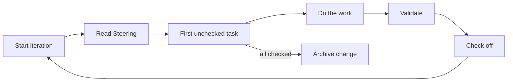

# Ralphy

[](https://www.npmjs.com/package/@neriros/ralphy)
[](https://www.npmjs.com/package/@neriros/ralphy)
[](https://github.com/NeriRos/ralphy/blob/main/LICENSE)
[](https://bun.sh)

An iterative AI task execution framework. Ralphy runs Claude or Codex in a checklist-driven loop with state on disk, cost safeguards, and a long-lived **agent** that polls Linear, opens PRs, and iterates with reviewers.

> 📘 Full reference — Linear indicators, lifecycle, PR/CI flow, CLI flags, MCP — lives in **[GUIDE.md](./GUIDE.md)**.

## How it works



Each iteration reads `## Steering` from `proposal.md`, picks the first unchecked item in `tasks.md`, does the work, validates, and checks it off. When every item is checked the loop archives the change.

## Install

Requires [Bun](https://bun.sh). The Claude engine also needs the [Claude CLI](https://docs.anthropic.com/en/docs/claude-cli).

```bash
npm install -g @neriros/ralphy   # or: bunx @neriros/ralphy
```

## Task mode — one-shot loop

```bash
ralphy loop task --name fix-auth --prompt "Fix the JWT validation bug" --claude opus --max-iterations 10

# Resume later (state is on disk)
ralphy loop task --name fix-auth

# Inspect
ralphy loop status --name fix-auth
```

Safeguards: `--max-iterations`, `--max-cost`, `--max-runtime`, `--max-failures`. Engine defaults to Claude Opus. See [GUIDE.md → CLI reference](./GUIDE.md#cli-reference) for the full set.

## Agent mode — Linear-driven

`ralphy agent` polls Linear, runs up to N concurrent task loops, and (optionally) opens PRs, watches CI, and iterates with reviewers. Requires `LINEAR_API_KEY`.

```bash
export LINEAR_API_KEY=lin_api_xxx
ralphy agent --linear-team ENG --linear-assignee me --concurrency 3 --create-pr --fix-ci
```

Each poll routes every matching issue into one of: **fresh** (Todo → scaffold + spawn), **resume** (In Progress → reattach), **conflict-fix** / **ci-fix** (PR red on GitHub → prepend fix task), or **review** / **code-review** (reviewer comments or `@ralphy` mention).

Configuration lives in **`WORKFLOW.md`** at the project root — YAML frontmatter for settings, followed by the Jinja-style prompt template the worker renders each iteration. A default is written on first run; CLI flags override per invocation.

See **[GUIDE.md](./GUIDE.md)** for:

- Lifecycle diagram + per-mode behavior
- `linear.indicators` schema and the full `WORKFLOW.md` example
- Confirmation gate (`@ralphy revise`, opt-in/out labels)
- `@ralphy` mentions, code-review iteration, self-review phase
- PR + CI integration (auto-merge, stacked PRs, fix-ci loop)
- Pre-existing error check, worktrees, tmux session management, dashboard, logs
- Complete CLI reference (task, agent, list modes)

## MCP server

Ralphy ships an MCP server (auto-configured on per-project install) exposing `ralph_list_changes`, `ralph_get_change`, `ralph_create_change`, `ralph_append_steering`, `ralph_stop`. See [GUIDE.md → MCP server](./GUIDE.md#mcp-server).

## Development

```bash
bun install
bunx nx run-many -t lint,typecheck,test,build   # all checks
bunx nx run cli:build                            # CLI only
```

Per-project install (builds + wires `.ralph/` and `.mcp.json` into the repo):

```bash
make install            # → ./.ralph
make install ~          # → ~/.ralph
make install /path/to   # → /path/to/.ralph
```
