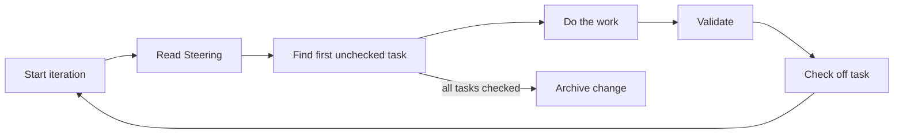
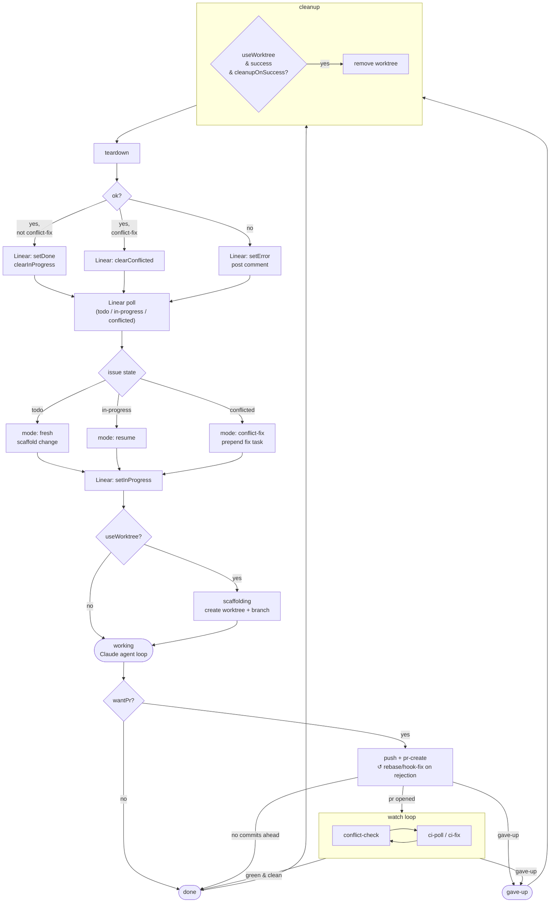

# Ralphy

[](https://www.npmjs.com/package/@neriros/ralphy)
[](https://www.npmjs.com/package/@neriros/ralphy)
[](https://github.com/NeriRos/ralphy/blob/main/LICENSE)
[](https://github.com/NeriRos/ralphy)
[](https://github.com/NeriRos/ralphy/issues)
[](https://bun.sh)

An iterative AI task execution framework. Ralphy orchestrates multi-phase autonomous work using Claude or Codex engines, with built-in state management, progress tracking, and cost safeguards.

## How It Works

Ralphy runs a single continuous loop against an OpenSpec change — no phases, no phase transitions.



Each iteration reads the `## Steering` section of `proposal.md`, picks the first unchecked item from `tasks.md`, does the work, validates, and checks the item off. When all items are checked the loop archives the change automatically.

## Agent Mode Flow

The full orchestration cycle from Linear poll through teardown:



## Installation

### npm (global)

```bash
npm install -g @neriros/ralphy
# or
bunx @neriros/ralphy
```

Requires [Bun](https://bun.sh) as the runtime.

### Local (per-project)

```bash
bun install
make install            # Install to ./.ralph
make install ~           # Install to ~/.ralph
make install /path/to   # Install to /path/to/.ralph
```

This builds the CLI and MCP server, copies them to `.ralph/bin/`, sets up phase definitions and templates, configures `.mcp.json`, and adds a `ralph` script to `package.json`. The `.ralph/` directory is gitignored by default.

### Prerequisites

- [Bun](https://bun.sh)
- [Claude CLI](https://docs.anthropic.com/en/docs/claude-cli) (for the Claude engine)
- `jq` (for installation)

## Usage

### Create and Run a Task

```bash
ralph task --name fix-auth --prompt "Fix the JWT validation bug" --claude opus --max-iterations 10
```

The engine defaults to Claude Opus.

### Resume a Change

```bash
ralph task --name fix-auth
```

If the task already exists, it resumes from where it left off.

### Check Status

```bash
ralph list                    # Table of all tasks
ralph status --name fix-auth  # Detailed view of one task
```

### Agent Mode (Linear integration)

`ralph agent` polls Linear for open issues and runs up to N concurrent task loops, scaffolding an OpenSpec change per new issue. Requires `LINEAR_API_KEY` in the environment.

```bash
export LINEAR_API_KEY=lin_api_xxx
ralph agent --linear-team ENG --linear-assignee me --concurrency 3 --poll-interval 60

# Limit the number of tickets processed in this run
ralph agent --max-tickets 5 --linear-team ENG --linear-assignee me
```

What it does on each tick:

1. Polls Linear for open issues matching the filter (team / assignee / status / labels)
2. Dedupes against in-flight workers and any already-active issues
3. For each new issue: fetches existing comments, scaffolds `openspec/changes/<id-slug>/{proposal.md,tasks.md,design.md}` (with the comments embedded so the worker sees prior discussion), then spawns `ralph task --name <id-slug>` up to the concurrency cap
4. Posts a "🤖 started" comment on the Linear issue and applies the `setInProgress` indicator (if configured)
5. On worker exit, posts a success/failure comment and applies the `setDone` indicator on success or `setError` on failure (if configured)

A default `ralphy.config.json` is written on first run with every defaulted setting filled in; CLI flags override config values per invocation.

```jsonc
{
  "concurrency": 3,
  "pollIntervalSeconds": 60,
  "maxIterationsPerTask": 0,
  "maxCostUsdPerTask": 0,
  "engine": "claude",
  "model": "opus",
  "linear": {
    "team": "ENG",
    "assignee": "me",
    "postComments": true,
    "updateEveryIterations": 10,
    "indicators": {
      "getTodo": { "filter": [{ "type": "status", "value": "Todo" }] },
      "getInProgress": { "filter": [{ "type": "status", "value": "In Progress" }] },
      "getConflicted": { "filter": [{ "type": "label", "value": "ralph:conflicted" }] },
      "setInProgress": { "type": "status", "value": "In Progress" },
      "setDone": {
        "apply": [
          { "type": "status", "value": "In Review" },
          { "type": "label", "value": "ralphy-done" },
        ],
      },
      "setError": { "type": "label", "value": "ralph:error" },
      "setConflicted": { "type": "label", "value": "ralph:conflicted" },
      "clearConflicted": { "type": "label", "value": "ralph:conflicted" },
    },
  },
  "useWorktree": true,
  "cleanupWorktreeOnSuccess": false,
  "setupScript": "bun install",
  "teardownScript": "git status",
  "appendPrompt": "Always run lint before committing.",
  "createPrOnSuccess": true,
  "prBaseBranch": "main",
  "fixCiOnFailure": true,
  "maxCiFixAttempts": 5,
  "ciPollIntervalSeconds": 30,
  "maxRuntimeMinutesPerTask": 0,
  "maxConsecutiveFailuresPerTask": 5,
  "iterationDelaySeconds": 0,
  "logRawStream": false,
  "taskVerbose": false,
}
```

Linear is the source of truth for which issues Ralph has touched. Each `linear.indicators` key names a lifecycle event:

- `getTodo` / `getInProgress` / `getConflicted` — `{ filter: [...] }` selectors used to find issues to pick up, resume, or repair.
- `setInProgress` / `setDone` / `setError` / `setConflicted` — single marker `{ type, value }` or `{ apply: [...] }` for multi-marker.
- `clearConflicted` — labels to remove once a conflicted PR is fixed (status removal is not supported).

Marker types are `"label"` or `"status"`. Combine markers under `apply` when one event needs to set multiple — e.g. `setDone` flipping a status _and_ adding a "shipped" label.

#### Per-task git worktrees

With `--worktree` (or `useWorktree: true` in config) each task runs in an isolated worktree at `.ralph/worktrees/<change-name>` checked out onto a fresh `ralph/<change-name>` branch. The change is scaffolded _inside_ the worktree, and the loop's cwd is the worktree, so concurrent workers can't stomp on each other.

Use `setupScript` (run inside the worktree right after scaffolding) to install dependencies, copy `.env`, etc. Use `teardownScript` (run after the loop exits and worktree cleanup) to gather artifacts or roll back local mutations. Both run via `sh -c`; failures are logged but never block the loop. With `cleanupWorktreeOnSuccess: true` the worktree is removed when the worker exits 0 — failed workers always keep their worktree (and branch) for human inspection.

**`appendPrompt`** (or `--prompt` in agent mode) is appended to every scaffolded `proposal.md` under an `## Additional instructions` section — use it for cross-cutting guidance every task should see.

**`updateEveryIterations`** (default `10`, `0` disables) posts a "🔄 Ralph progress update: iteration N" comment on the Linear issue every N task iterations. Requires `postComments: true`.

**`createPrOnSuccess`** (or `--create-pr`) pushes the worker's branch and opens a GitHub PR via `gh` after a clean exit. Requires `--worktree` (the PR needs a branch to point at) and the `gh` CLI authenticated. The PR title is `<ID>: <title>`, the body links the Linear issue. If a PR already exists for the branch the existing URL is reported (idempotent for retries). `prBaseBranch` defaults to `main`.

**`fixCiOnFailure`** (or `--fix-ci`) watches the PR's checks via `gh pr checks` and, on failure, fetches the failed-run logs (`gh run view --log-failed`), appends them to `proposal.md` under `## Steering`, re-spawns the task loop in the worktree, and pushes the new commits — repeating until checks go green or `maxCiFixAttempts` is hit (default 5, polling interval `ciPollIntervalSeconds` defaults to 30s). Requires `--create-pr`.

When `fixCiOnFailure` is enabled, the `setDone` indicator is **not** applied (and the issue is not marked processed in `.ralph/agent-state.json`) until CI actually goes green. If the fix loop exhausts its attempts the worker is treated as failed for completion-marking purposes and the issue will be re-picked-up on the next poll (the `getInProgress` filter ensures that).

Every CLI flag is also configurable in `ralphy.config.json`; CLI values override config when both are set. The agent forwards `maxRuntimeMinutesPerTask` / `maxConsecutiveFailuresPerTask` / `iterationDelaySeconds` / `logRawStream` / `taskVerbose` to each spawned `ralph task` worker.

Failed workers (non-zero exit) are not marked processed, so they'll be retried on the next poll. SIGINT/SIGTERM cleanly stops polling and kills active workers. All Linear side effects are best-effort — failures log a warning but never block the task loop.

## CLI Options

| Option                 | Description                                              |
| ---------------------- | -------------------------------------------------------- |
| `--name <name>`        | Task name (required for most commands)                   |
| `--prompt <text>`      | Task description                                         |
| `--prompt-file <path>` | Read prompt from a file                                  |
| `--claude [model]`     | Use Claude engine (haiku/sonnet/opus)                    |
| `--codex`              | Use Codex engine                                         |
| `--model <model>`      | Set model (haiku/sonnet/opus)                            |
| `--max-iterations <N>` | Stop after N iterations (0 = unlimited)                  |
| `--max-cost <N>`       | Stop when cost exceeds $N                                |
| `--max-runtime <N>`    | Stop after N minutes                                     |
| `--max-failures <N>`   | Stop after N consecutive identical failures (default: 5) |
| `--unlimited`          | Set max iterations to 0 (unlimited, default)             |
| `--delay <N>`          | Seconds to wait between iterations                       |
| `--log`                | Log raw JSON stream output                               |
| `--verbose`            | Verbose output                                           |

### Agent mode flags

| Option                    | Description                                                                   |
| ------------------------- | ----------------------------------------------------------------------------- |
| `--linear-team <key>`     | Linear team key (e.g. `ENG`)                                                  |
| `--linear-assignee <id>`  | Filter by assignee (user id, email, or `me`)                                  |
| `--poll-interval <s>`     | Seconds between Linear polls (default: 60)                                    |
| `--concurrency <n>`       | Max concurrent task loops (default: 1)                                        |
| `--max-tickets <n>`       | Stop picking up new issues after N have been started this run (0 = unlimited) |
| `--worktree`              | Run each task in its own git worktree                                         |
| `--indicator <k>:<t>:<v>` | Override a `linear.indicators` entry; repeatable (e.g. `setDone:status:Done`) |
| `--create-pr`             | Push worker branch + open a GitHub PR on success (needs `--worktree`)         |
| `--fix-ci`                | After PR opens, re-run task on CI failures until green (needs `--create-pr`)  |

#### `--max-tickets`

Use `--max-tickets N` to cap how many issues ralph picks up in a single agent run. Once N issues have been started (across fresh, resume, and conflict-fix modes), the coordinator stops enqueuing new work. In-flight workers continue to completion. The limit resets each time you restart `ralph agent`.

```bash
# Process at most 3 issues this session, then idle
ralph agent --max-tickets 3 --linear-team ENG
```

When the limit is reached, ralph logs a yellow notice and the dashboard header shows `│ tickets ≤N`. Polling continues (to handle conflict re-fixes on already-started issues), but no new issues are queued.

#### Dashboard

The `ralph agent` terminal dashboard shows a full-terminal layout with three always-visible panels:

- **RALPH AGENT** (blue box): engine/model, concurrency, poll interval, active limits (`iter ≤N`, `cost ≤$N`, `tickets ≤N`), feature flags (● PR ● fixCI ● worktree), and the Linear filter on the second line
- **POLL STATUS + WORKERS** (side-by-side): last-poll counts and next-poll countdown; active/queued worker totals with colored counts
- **TASKS tab bar** (when multiple workers run): numbered worker tabs with priority glyph and phase — Tab/← → to switch, 1-9 to jump

Each worker card shows:

- Priority badge (`▲ URGENT` / `↑ HIGH` / `· MED` / `↓ LOW`) + issue identifier + title + mode badge (`[NEW]` / `[RESUME]` / `[FIX]`)
- `↗ LINEAR  ISSUE-ID` and `↗ PR  #N` (short labels, not full URLs)
- `▶ TASK` — first unchecked task from `tasks.md`, updated every second
- `PHASE` with color (cyan = working, yellow = git ops, blue = CI, green = done, red = gave-up) + time in phase
- `⏵ CMD` when a shell command is in flight (shows the command and how long it's been running)
- `LOG` — path to the worker's log file for `tail -f` (format: `[ISO] [type] message`)
- `─ OUTPUT ─` section with live stdout/stderr (scales to fill remaining terminal height for the focused worker)

### Log files

All log entries use the format `[2024-01-15T12:00:00.000Z] [type] message`. Four log types:

| Type      | Meaning                                            | Destination                                        |
| --------- | -------------------------------------------------- | -------------------------------------------------- |
| `session` | Worker start / stop boundaries                     | `agent-mode.log` + worker log                      |
| `phase`   | Phase transitions (working → pushing → ci-poll …)  | `agent-mode.log` + worker log                      |
| `coord`   | Coordinator events (Linear poll, worktree, labels) | `agent-mode.log` + worker log (when task-specific) |
| `output`  | Raw subprocess stdout/stderr lines                 | Worker log only                                    |

- **`~/.ralph/agent-mode.log`** — global session log, appended each agent run
- **`<projectRoot>/.ralph/logs/<change>.log`** — per-worker unified log; includes output, phases, and coordinator events for that task. `tail -f` this for live progress.
- **`<taskDir>/LOG.jsonl`** — structured JSON event log for the web UI (each line has a `ts` field)

## OpenSpec Flow

There are no phases. One loop, one prompt, one `tasks.md` checklist.

Each change lives in `.ralph/tasks/<name>/`:

| File / Directory    | Purpose                                                   |
| ------------------- | --------------------------------------------------------- |
| `proposal.md`       | Description, goals, and the `## Steering` section         |
| `design.md`         | Technical design and architecture decisions               |
| `tasks.md`          | Checklist driving iteration — one unchecked item per loop |
| `specs/`            | Detailed specifications for individual tasks              |
| `.ralph-state.json` | Loop state (iteration count, status, cost, history)       |
| `STOP`              | Create this file to signal the loop to stop               |

Steering is delivered by editing the `## Steering` section of `proposal.md`. The agent reads it at the start of every iteration.

## MCP Server

Ralphy includes an MCP server that exposes task management tools to Claude agents. It's automatically configured during installation. Available tools:

- `ralph_list_changes` — List changes with status
- `ralph_get_change` — Get change details
- `ralph_create_change` — Create and optionally start a change
- `ralph_append_steering` — Append a steering message to `proposal.md`
- `ralph_stop` — Stop a running change

## Project Structure

```
ralphy/
├── apps/
│   ├── cli/          # CLI application
│   └── mcp/          # MCP server
├── packages/
│   ├── core/         # State management and loop
│   ├── context/      # Storage abstraction
│   ├── content/      # Base prompt and task templates
│   ├── engine/       # Claude/Codex engine spawning
│   ├── openspec/     # ChangeStore interface and OpenSpec adapter
│   ├── output/       # Terminal formatting
│   └── types/        # Zod schemas and types
└── Makefile
```

## Development

```bash
bun install
bunx nx run-many -t lint,typecheck,test,build   # Run checks
bunx nx run cli:build                            # Build CLI only
```
