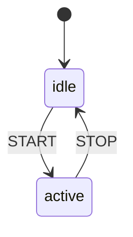

<!-- Generated by `bun run build:state-diagrams` — do not edit by hand. -->

# `example` state machine

Minimal idle ↔ active example machine.

```mermaid
stateDiagram-v2
  [*] --> idle
  idle --> active: START
  active --> idle: STOP
```
