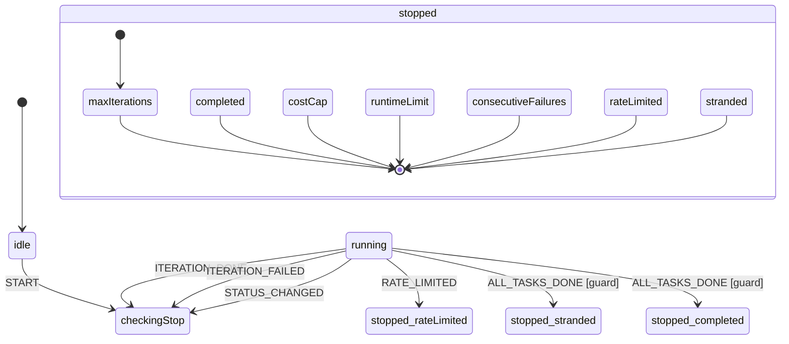

<!-- Generated by `bun run build:state-diagrams` — do not edit by hand. -->

# `loop` state machine

Loop stop-condition guards: maxIterations, costCap, runtimeLimit, consecutiveFailures.

## Note: `checkingStop` `always` guards

The diagram above is generated from each state's `on` transitions. The
`checkingStop` state instead routes via eventless `always` transitions,
which the exporter does not render. For reference, `checkingStop`
evaluates these guards in order and transitions to the first match:

| Guard                        | Target                        |
| ---------------------------- | ----------------------------- |
| `maxIterationsReached`       | `stopped.maxIterations`       |
| `statusNotActive`            | `stopped.completed`           |
| `costCapReached`             | `stopped.costCap`             |
| `runtimeLimitReached`        | `stopped.runtimeLimit`        |
| `consecutiveFailuresReached` | `stopped.consecutiveFailures` |
